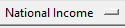
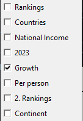
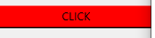
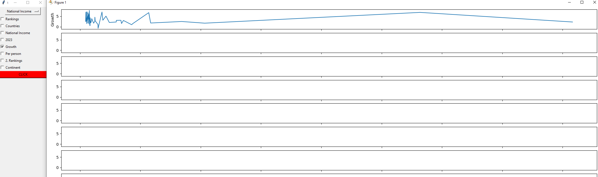

# 🎉This is data visualization project with tkinter
✍️I had wrote this for my university project.
## 🧑Manual
First be sure about you pip these thing
```
python
```
```
pip install openpyxl
```
```
pip install pandas
```
```
pip install matplotlib
```
```
pip install seaborn
```
then when you open the app which is not exe you can exe the script.
```
it wants you to select the file after that you can see the app
```
then
```
in the picture bellow you see, it wants you to give the X lable so click on it and select
```


```
in the picture bellow you see, it wants you to give the y lable so select it
```


```
in the picture bellow you see, it is a button so click and you can see the chart
```


this is my slad days project and i just starting learning python, so that is the resone why UI AND UX are old.

## 🧮App



---
👨‍💻Used Technologies
- python
- tkinter
- pandas
- numpy
- matplotlib
- seaborn
